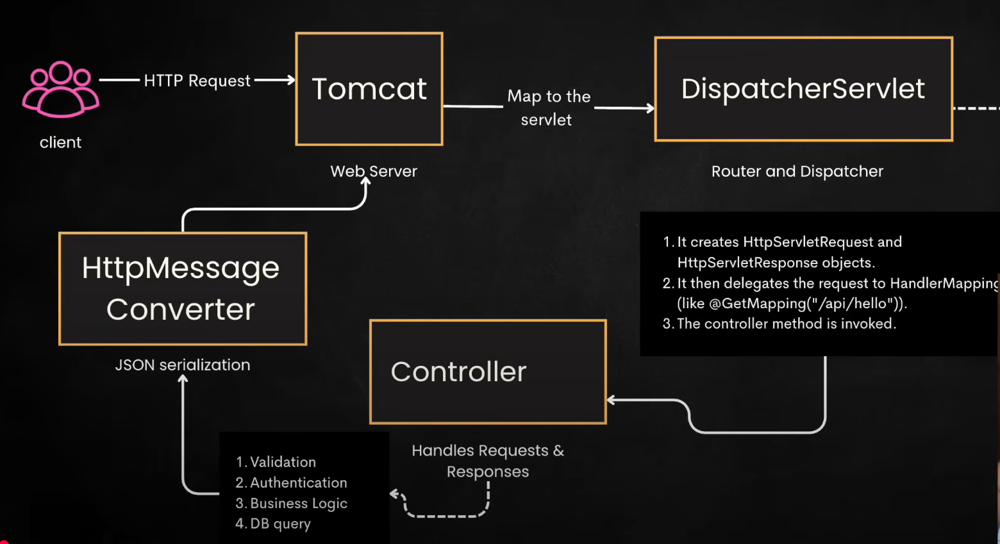
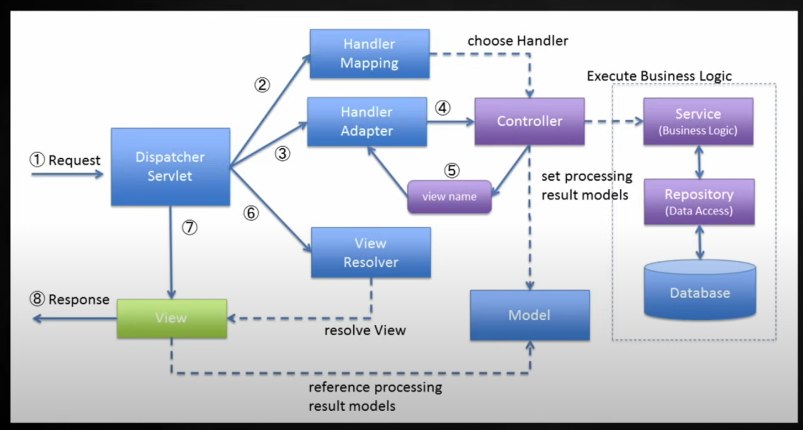
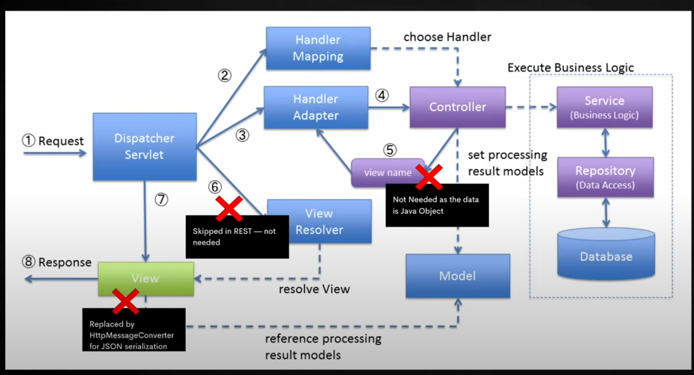
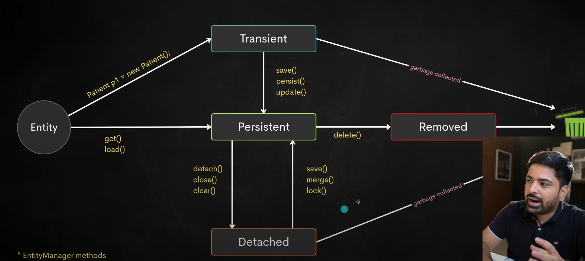
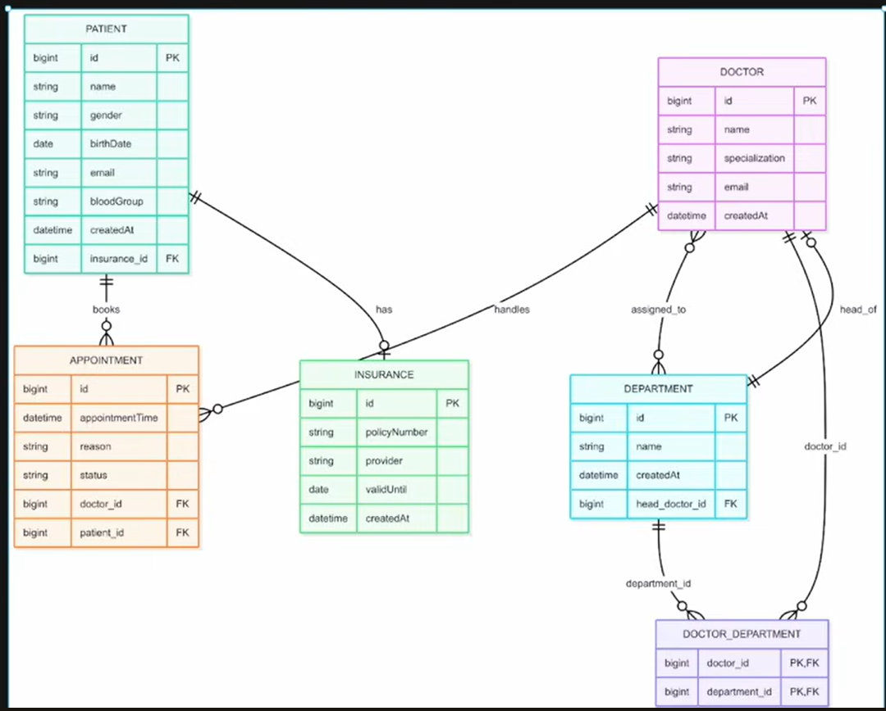

# Spring Boot

************************ **Project 1** ************************

## Spring 
### solve problem (with introduction of dependency injection and IOC container)
- Tight Coupling
- Hard to Test
- Scattered object creation

### Spring Framework Modules
- The Spring Framework provides a comprehensive programming and configuration model for modern Java- based enterprise applications - on any kind of deployment platform.


### Spring Vs Spring Boot
| **Feature**             | **Spring**                             | **Spring Boot**                       |
|-------------------------|----------------------------------------|---------------------------------------|
| **Configuration**        | Manual (XML/Java-based)                | Auto-configuration                    |
| **Web Server**           | External (e.g., Tomcat)                | Embedded (e.g., Tomcat, Jetty)        |
| **Setup Complexity**     | High                                   | Low                                   |
| **Development Speed**    | Slower (more configuration)           | Faster (minimal setup)                |
| **Flexibility**          | High (manual setup, more control)      | Opinionated defaults (but customizable)|
| **Production-Ready**     | Needs additional setup                | Built-in features (metrics, health checks)|
| **Ideal For**            | Large, complex, or legacy apps        | Microservices, new projects, quick setups|


### Spring Boot
- extended version of Spring Framework
- Auto configuration, tooling, etc (you get spring boot)

### Lets Start with the spring boot
- site: start.spring.io
- select type and tech stack and generate the spring boot project
- eg: Maven, Java, Version, Jar, Java 21
- add dependencies (search and add dependencies)
    - Spring web (dependency) : apache tomcat server already configured
- generate project (zip file download)
- open the zip in intelliJ
- we will write all the code in src (main: all buisness logic, test)

- **pom.xml**
    - manage dependencies
    - change version
    - whole java project management

- **resource folder**
    - application.properties (file)
        - We can configure our project with help of this file
        - web, database, spring boot

- **Run the project** 
    - go to src/main/java/../projectName.java
    - run the main function (run button of intelliJ)
    - server start on port = 8080 (default) 
        - seee terminal log for more detail
        
### Internal Working of Spring Boot
- **Bean** : We will understand this with exmaple -> BeanRazorpayService
    - create class : RazorPayPaymentService
    - if we use object of this class in our spring boot application
        - RazorPayPaymentService payment = new RazorPayPaymentService();
        - tight copuling : our application is dependent on razorpay payment service, in future if we need to use different payment service we need to change in code, to avoid this we use Beans and Dependency injection
    
    - **Defination** : A bean in Spring is simply an object that is managed by the Spring container. It is created, configured, and maintained by the Spring IoC container.
    - **Annotation** : @Component, @Service, @Repository, @Controller

    - No need to create object to use (no need to use new keyword)

    - **How to use Bean**
        1) Dependency Injection (inject dependencies into spring managed beans)
        - create constructor with parameter (RazorPayPaymentService)
        - this is better than the autowired one, because here we tell explicitly that our class is dependent on which dependencies
        - also we can use final
            ```java
            // in main springbootapplication
            private BeanRazorPayPaymentService paymentService;

            public LearningSpringBootApplication(BeanRazorPayPaymentService paymentService){
                this.paymentService = paymentService;
            }
            ```
        2) Autowired
        - can't use final keyword
            ```java
            // in main springbootapplication
            @Autowired
            private BeanRazorPayPaymentService paymentService;
            ```

    - **Benifit**
        - Allow Loose Coupling in the code
    
    - if multiple bean
        - it will give error if no condition is defined for beans
        - solution: 
            - make one bean primary
            - use condition to select the bean
        - configuration (resources> application.properties)
            - payment.provider = stripe
            - 
        ```java
        public interface PaymentService{};

        @Component
        @ConditionalOnProperty(name="payment.provider", havingValue="razorpay")
        public class BeanRazorPayPaymentService implements PaymentService{};
        
        @Component
        @ConditionalOnProperty(name="payment.provider", havingValue="stripe")
        public class BeanStripePaymentService implements PaymentService{};

        // in main springbootapplication
        private final PaymentService paymentService;
        public LearningSpringBootApplication(PaymentService paymentService){
            this.paymentService = paymentService;
        }
        ```

- **IOC(Inversion of Control) or Spring Container** 
    - IoC refers to the principle where the control of object creation and management is inverted. In a traditional program, you create objects manually (using new). In IoC, the Spring container is responsible for instantiating and managing objects.

- Component Scanning
    - Start from @SpringBootApplication, only one in one project, used with main project class
    - Component Scanning is the process where Spring automatically detects and registers beans (classes annotated with @Component, @Service, @Repository, @Controller, etc.) within the application context.


### What happens when you run spring boot application


************************ **Project 2** ************************

## How Does the Web Server work in Spring Boot


- MVC Architecture
- Spring MVC (traditional flow)
  
- Spring MVC with REST API
  

## Build REST API
- We will use 3 layer Architecture (controller, service, repository)
  - 
    -  1. **Client Request:**
        - The client sends data (usually in JSON format) via HTTP.
    -  2. **Presentation Layer (Controller):**
        - Receives the request.
        - Converts JSON into a **DTO** (Data Transfer Object).
    -  3. **DTO:**
        - A simplified object that carries data between layers (decouples client data and internal models).
    -  4. **Service Layer:**
        - Contains **business logic**.
        - Receives the DTO, processes it, and interacts with the persistence layer.
        - Maps **DTO** to **Entity** for database operations.
    -  5. **Persistence Layer:**
        - Interacts with the database.
        - Saves or retrieves **Entities** (representations of database tables).
    -  6. **Database:**
        - Stores and retrieves data (using **Entities**).


- Request (Client) → Controller → Service → Repository → Entity/Model ↔ Database ↔ Repository → Service → Controller → Response (JSON/View)


### Student Management (RETS API)
- **Controller**
- Use `@RestController` to make class as controller
  - `@RestController`: Combines `@Controller` and `@ResponseBody` to simplify the creation of RESTful APIs that return data directly in response (usually in JSON).

- **Handler**
  - `@GetMapping` : Maps HTTP GET requests to a specific method in the controller to fetch data.
  - `@GetMapping("/endpoint")` : Use to make GET Request Handler for `/endpoint`

-**DTO (Data Transfer Object)**
  - A simplified object that carries data between layers, decoupling external client data from internal models.

#### Lombok annotation
  - `@Data` : It simplifies the creation of Java beans (POJOs) by automatically generating common boilerplate code, such as getters, setters, toString(), equals(), and hashCode() methods.
  - **Key Features of `@Data`:**
    - **`@Getter`**: Automatically generates getter methods for all fields.
    - **`@Setter`**: Automatically generates setter methods for all fields.
    - **`@ToString`**: Automatically generates a `toString()` method that includes all fields.
    - **`@EqualsAndHashCode`**: Automatically generates `equals()` and `hashCode()` methods based on all fields.
    - **`@RequiredArgsConstructor`**: Generates a constructor for all final fields or fields marked with `@NonNull`.

  - **`@AllArgsConstructor`**: It creates a constructor for the class with **all fields** as parameters.

  - **`@RequiredArgsConsturctor`**: automatically generates a constructor with parameters for all final fields or fields marked with `@NonNull`.
  
  - **`@NoArgsConstructor`** : utomatically generates a public no-argument constructor for a Java class at compile time — eliminating boilerplate.
  
  - **`@ToString`** : This will create toString Method for that class
    - `@ToString.Exclude` : Variable with this annotation will not be used in toString Method of that class

- We will use PostGreSQL for database and DBeaver for graphical analysis
  - install using chocolatey
  - `choco install postgresql`
  - `choco install dbeaver`

#### DBeaver
- DBeaver is a universal database management tool — it’s a GUI (graphical user interface) client that helps you interact with databases visually, instead of using just command-line tools like psql.
  - how to use DBeaver
    - open dbeaver app
    - check is postgres running or not using command `Get-Service -Name postgresql*`
    - connect the database, here we will use postgresql
    - provide hostname, database, username, password and testconnect to check connection is establishing or not, then finish
    - **Note** : If Database driver is not installed install it using download button popup when clicked test connection

### Continue with the project
- Lets add two more dependencies
  - `PostgreSQL Driver` and `Spring Data JPA`
  - Go to start.spring.io and add dependencies and click on explore to get the xml and copy paste the dependency xml to pom.xml
  - After adding the dependencies to pom.xml use sync with maven button in intelliJ to download the dependencies

- configure the database, provide the configure in application.properties
  - spring.datasource.url=jdbc:postgresql://localhost:5432/studentsDB
  - spring.datasource.username=postgres
  - spring.datasource.password=qwerty123
  - spring.jpa.hibernate.ddl-auto=update
  - spring.jpa.show-sql=true
  - spring.jpa.properties.hibernate.format_sql=true

- We will create schema in entity, like student entity. This will create student table in database and create attributes as mentioned in the studentEntity
  - use `@Entity` annotation to create entity
  ```java
    @Entity
    public class Student {
        @Id
        @GeneratedValue(strategy = GenerationType.IDENTITY)
        private Long id;
    
        private String name;
        
        private String email;
    }
  ```
  - As attributes in entity are private, we need to create getter and setter to access the values of thta attributes
  - We will use `@Getter` and `@Setter` annotation to create getter and setter

#### ORM : Object-Relational Mapping
- ORM allows you to interact with your database using Java objects instead of writing raw SQL queries. You define entity classes in Java, and the ORM framework maps these entities to database tables and manages CRUD operations automatically.
  - Instead of writing lots of SQL queries to interact with the database,
  - You work with normal Java objects (called entities),
  - And ORM automatically takes care of saving, updating, deleting, or fetching these objects from the database.

#### Repository
- A Repository is a special interface in Spring Boot that acts as a bridge between your application and the database. It helps you perform database operations like saving, reading, updating, and deleting data — without writing SQL queries.
```java
  @Repository
  public interface StudentRepository extends JpaRepository<Student, Long> {}
```
- Parameter : <Student, Long> 
  - Student — the type of the entity (your Java class that maps to a database table). 
  - Long — the type of the entity's primary key (ID) field.

#### Service
- Service Interface which will implement ServiceImplementation
- We will need to make bean of ServiceImplementation so we will use `@Service` annotation 
- `@Service` is a specialized stereotype annotation in Spring that marks a class as a service component in the service layer of your application.
- ServiceImplementation class will interact with the repository

#### Path Variable (dynamic)
- Variable used in path, dynamic value
```java
@GetMapping("/student/{id}")
public void getStudentDetail(@PathVariable("id") Long studentId){
    return ;
}
```
- here {id} is pathVariable
- if we need to rename the path variable for the function
  - `@PathVariable("pathVariable") DataType newPathVariable`

#### Query Params
- ?key=value
- Used to filter or search data. They go in the URL after a ?.
- url: // GET /student?department=mechanical&year=2025
```java
@GetMapping("/student")
public void getStudentDetail(
        @RequestParam(value= "department", defaultValue = "Computer Science and Engineering") String departmentName,
        @RequestParam(required = false) String year){}
```

#### Model Mapper
**ModelMapper** is a Java library that simplifies the process of mapping one object to another — especially useful when converting between:
- `Entity ↔ DTO`
- `Request DTO ↔ Domain Model`
- `Domain Model ↔ Response DTO`

Instead of manually copying every field, **ModelMapper** can handle it for you automatically.
**Note** : Make sure both have same field and Need to have public no-args constructor

- Configure : /config/MapperConfig.java
```java
@Configuration
public class ModelMapperConfig {
    @Bean
    public ModelMapper modelMapper() {
        return new ModelMapper();
    }
}
```
- how to use
```java
private final ModelMapper modelMapper;
void func() {
    modelMapper.map(student, StudentDto.class);
    // This will create new object
}
```

#### ResponseEntity

`ResponseEntity<T>` is a generic wrapper for HTTP responses in Spring Boot. It allows you to:

- Set **status codes** (e.g., 200 OK, 404 Not Found, 201 Created)
- Set **headers**
- Return a **body**
- Handle **errors** or **conditional responses** cleanly

---

- **Syntax**
    ```java
    ResponseEntity<T> response = new ResponseEntity<>(body, status);
    ```
    
    Or using static helper methods:
    
    ```java
    ResponseEntity.ok(body); // 200 OK
    ```

#### Spring Boot Starter Validattion
- Dependency which will validate the fields, like if its email it should follow the format of email
- **Steps**
  - Add dependency to the pom.xml and rebuild the maven
- **Syntax**
- `@Size(min=3, max=32, message="Size of Name sould be between 3 to 32 characters"` : This will check weather the size of Name field is matched or not
- `@Email` : This will check and validate the email format

- To use this validation we need to add `@Valid` annotatoin 

- **Example**
```java
    public class AddStudentRequestDto{
        @Email
        @Size(min=3, max=32, message="not valid size")
        @NotBlank(message = "Field is required can't be blank") 
        public String email;
        
    }
    
    @PostMapping("/post")
        public ReturnType FuncitonName(@RequestBody @Valid AddStudentRequestDto addStudentRequestDto){
    }
```

### Spring Boot Data JPA
- It provides an abstraction layer over JPA (Java Persistence API). It simplifies data access and database operations in a Spring-based application, making it easier to interact with relational databases (such as MySQL, PostgreSQL, Oracle, etc.) using JPA.
- i.e It is a library through which we can perform Database operation using spring boot code
- Here we will learn
  - DB Connection
  - DB Query and Query Optimization
  - Cascade Types
  - Indexes
  - 1:1, 1:M, M:N Mapping
  - Fetch Query


#### Entity
- an entity is a Java class annotated with `@Entity` that maps to a table in a relational database. It represents the structure of your data and is managed by JPA/Hibernate.
- Entity class with help of hibernate creates table with the fields in the class

#### Testing in Spring Boot
- Create Class in test directory of project
  - test/java/projectName/PatientTests.java
- We can run individual tests also without running the full application
- `@SpringBootTest` annotation to tell spring boot that this class is test class
- `@Test` annotation is used to define tests methods

#### JPA Repository


#### Hibernate Entity LifeCycle


#### Entity Manager and Persistence Context
- Persistence Context is used as first level cache, when same operation in transaction is performed it check in persistence context first if data found return the same if not then search in database
- Exmaple
```java
    @Service
    public class PatientService {
        @Transactional
        public void getPatientById() {
            Patient p1 = patientRepository.findById(1);
            Patient p2 = patientRepository.findById(1);
            System.out.println(p1 == p2); // This will give true 
    
            // Here we are using Transaction so both patient p1 and p2 will be same, db search will happen only one time
        }
    }
```
- In Transaction, we don't need to save the change it will saved automatically
  - code:
  ```java
    @Transactional
    public Patient getPatientById(Long id){
        Patient p1 = patientRepository.findById(id).orElseThrow();
        p1.setName("Saddy");
        // patientRepository.save(p1);  // No need to save, it will get saved automatically
    }
  ```

#### Annotation Related to Entity
1) `@Table`
- Specifies the details of the database table.
- It is used alongside the `@Entity` annotation.
- Example
```java
@Table(
        name = "employees",
        schema = "hr",  // optional
        catalog = "corporate_db",   // optional
        uniqueConstraints = {
                @UniqueConstraint(columnNames = {"email"}),
                @UniqueConstraint(name = "uk_emp_code", columnNames = {"employee_code"})
        },
        indexes = {
                @Index(name = "idx_emp_name", columnList = "name"),
                @Index(name = "idx_emp_name_email", columnList = "name, email"),
                @Index(name = "idx_emp_email", columnList = "email", unique = true)
        }
) 
```
- **Attributes**

| Attribute            | Description                                                                 |
|----------------------|-----------------------------------------------------------------------------|
| `name`               | Name of the table in the database. If omitted, defaults to the class name. |
| `schema`             | Name of the database schema (optional).                                     |
| `catalog`            | Name of the database catalog (optional).                                    |
| `uniqueConstraints`  | Specifies unique constraints across one or more columns.  [Array]           |
| `indexes`            | Defines indexes on the table columns.         

- `uniqueContraints` make the insertion slow, use wisely
- **Note** : If we make change to name of either table or columns then new table / column with the updated name will be created

2) `@Column`
- Specify the detail of the column
```java
    @Column(name = "patient_name", nullable = false, unique = false, length = 64)
    private String name;
```

3) `@CreationTimestamp`
- Fill the value of field with the currentTime
```java
    @CreationTimestamp
    @Column(updatable = false)
    private LocalDateTime createdAt;
```

#### Database Initialization
- When we run our project, we want to feed some data 
- create /resources/data.sql and write the SQL QUERY
- we will update the application.properties to perform the SQL QUERY in data.sql
```
spring.jpa.defer-datasource-initialization=true
spring.sql.init.mode=always
spring.sql.init.data-locations=classpath:data.sql
```
- files in the resources folder will automatically accessed by classpath
- after this, run the spring boot application

#### Migratoin
-

### JPQL & Query Methods in Spring Boot

#### JPA Query Methods
- If we need to find the data by name, i.e patientRepository.findByName(name). As this is not present inpatientRepository, so we will create method findByName in patientRepository
- JPA will automatically create the implementation of this method, we just need to initialize this method in patientRepository
- This findByName is a Query Method
- naming format : `findBy`+`variableName`(in Camel Case)
- Example
```java
    // Entity's Field
    private String name;
    private LocalDate birthDate;
    private String email;
    
    // Query Method in patientRepository
    Patient findByName(String name);
    Patient findByEmail(String email);
    Patient findByBirthDate(LocalDate birthDate);
    List<Patient> findByNameOrEmail(String name, String email);
    List<Patient> findByGender(String gender);
```
- We can also use Or, And for multiple Variable
- [Refer This URL to learn More about Query Method in Spring Data JPA](https://docs.spring.io/spring-data/jpa/reference/jpa/query-methods.html)

#### JPQL
- We will use `@Query` annotation to write our custom JPQL Query for Method in patientRepository
```java
    // in patientRepository
    @Query("select p from Patient p where p.bloodGroup = ?1")
    List<Patient> getPatientByBloodGroup(@Param("bloodGroup") BloodGroupType bloodGroupType);
    
    @Query("select p from Patient p where p.birthDate > :birthDate")
    List<Patient> findByBornAfterDate(@Param("birthDate") LocalDate birthDate);
    
    @Query("select p.bloodGroup, count(p) from Patient p group by p.bloodGroup")
    List<Object[]> countPatientByBloodGroup();
```
- JPQL is similar to SQL Query but little different
- In JPQL we will use class name, variables in class like Patient, bloodGroup not patient for table in database and blood_group as column in patient table
- we can't use * to select all the columns of the table, instead we use `p` for all variable or `p.VariableName` for specific variable comma seperated
- **Parameter**
  - :param (named parameter)
  ```java
    @Query("select p from Patient p where p.bloodGroup = :bloodGroup")
    List<Patient> getPatientByBloodGroup(@Param("bloodGroup") BloodGroupType bloodGroupType);
  ```
  - ?1 (positional parameter)
  - 1 is position of variable
  ```java
    @Query("select p from Patient p where p.bloodGroup = ?1")
    List<Patient> getPatientByBloodGroup(BloodGroupType bloodGroupType);
  ```
- it is mandatory to use both `@Transactional` and `@Modifying` when you're executing an update (or delete) query in Spring Data JPA using `@Query`.
```java
    @Transactional
    @Modifying
    @Query("update Patient p set p.name = :name where p.id = :id")
    int updateNameById(@Param("name") String name, @Param("id") Long id);
```

#### Native Query
- Pure SQL Query in Spring Boot
- Using same `@Query` annotatoin, just add attribute nativeQuery = true
```java
    @Query("select * from patient", nativeQuery = true)
    List<Patient> findAllPatient();
```
- Here we will use db table name, column name instead of class name and its variables

#### Projection
- Projection is the way to fetch only the specific fields 
- **Scenerio**: If we want data and we return in Patient DTO but only want to fetch specific details then rest field will be null, so to avoid this we use projection where it will return only the specific fields that we need
- Database will return the speific column only, we need to convert it to desired DTO
- Copy Path Reference of the DTO
- In JPQL Query after select use new keyword and paste the path reference of DTO and pass the selected fields as parameter to that path reference DTO
```java
@Query("select new com.learning._learningJPA.entity.dto.BloodGroupCountResponseEntity(p.bloodGroup, count(p)) from Patient p group by p.bloodGroup")
// Instead of Returning Object[], we will use our custom DTO to avoid null values for unwanted fields in Patient Entity
// List<Object[]> countPatientByBloodGroup();
List<BloodGroupCountResponseEntity> countPatientByBloodGroup(); 
```
- **Note** : Projection can only be done with the JPQL Query not with the Native Query, in case of Native Query Result will be same as Returned form Native Query

#### Pagination
- Return The limited number of row 
- Can be used with JPQL and Native Query both
- Need to pass Pageable Parameter to the patientRepository method 
```java
    @Query(value = "select * from patient", nativeQuery = true)
    Page<Patient> findAllPatient(Pageable pageable);
```
- When Calling this method need to pass parameter : `PageRequest.of(<PageNumber>, <PageSize>)`
```java
Page<Patient> patientList = patientRepository.findAllPatient(PageRequest.of(0, 5));
```
- `PageRequest.of(0, 10, Sort.by("name").ascending().and(Sort.by("birthDate").descending()));`
- We can return the data in List<Patient> but we will use `Page<Patient>` this will also give extra details like total number of pages, etc along with `List<Patient>`

### Spring Data JPA Mapping
We will Build Hospital Management System


#### Mapping
- Mapping describes how an entity (table) is related to another entity (table)
- **Types**
  1) `@OneToOne`
  2) `@OneToMany`
  3) `@ManyToOne`
  4) `@ManyToMany`
- Two Entity can have multiple relationship between them
  - relationship 1: Many to Many (One doctor can work in many department (multitalented), Many Doctor in single department)
  - realationship 2: One to One (Each department have one manager(doctor), one doctor is manager of only one department)

##### Join Column
- In JPA, `@JoinColumn` is used to specify the foreign key column that connects two tables
- **Syntax**
```java
    @OneToOne
    @JoinColumn(name = "column_name", unique=false, nullable=true)
    private Insurance insurance;
```

##### Owning Side and Inverse Side
- When we create Relationship like `@OneToOne` in Patient, it is unidirectoinal i.e only Patient knows about Insurance.
- If we also create @OneToOne in Insurance pointing back to Patient, it becomes bidirectional.
- Without proper configuration, this creates ambiguity, because both sides may try to own the foreign key — resulting in duplicate or conflicting foreign key mappings in the database.
- To avoid this ambiguity, we will use Owning side and Inverse side
- We will use mappedBy attribute in OneToOne relationship type in Inverse side, it will result in bidirectional and remove ambiguity
```java
    // *************** Patient Entity *****************
    // Owning Side
    @OneToOne
    @JoinColumn(name = "patient_insurance_id")
    private Insurance insurance;

    // *************** Insurance Entity ****************
    // Inverse Side
    @OneToOne(mappedBy = "insurance")   // This will map to insurance field in Patient Entity
    private Patient patient;
```
- Entity which can live without the Assosiated Entity will be Inverse Side
- Example: Patient Can live without Appointment, means Patient will be Inverse side and Appointment can't live without Patient, hence Appointment will be Owning Side
- Inverse side will not create foreign key in SQL, it will tell JPA and it will be bidirectional
- **Note** : Update done on Inverse side will not update on Owning side

##### ManyToMany Relationship
- One Doctor can be in many Department (multitalented) and Each Department can have multiple Doctor in it
- In a ManyToMany relationship in JPA (Java Persistence API), a join table is created to store the associations between the two entities. The join table will contain two foreign key columns, each referencing one of the entities involved in the relationship. These two columns, along with any other relevant columns, will serve as the primary key for the join table.
```java
    // In Department Entity
    
    @ManyToMany
    @JoinTable(
            name = "department_doctors",
            joinColumns = @JoinColumn(name = "department_id"),
            inverseJoinColumns = @JoinColumn(name = "doctor_id")
    )
    private Set<Doctor> doctors = new HashSet<>();  
```


### Helpfull Tools
#### JPA Buddy
- plugin that will have to perform certain task related to JPA, no need to code by yourself